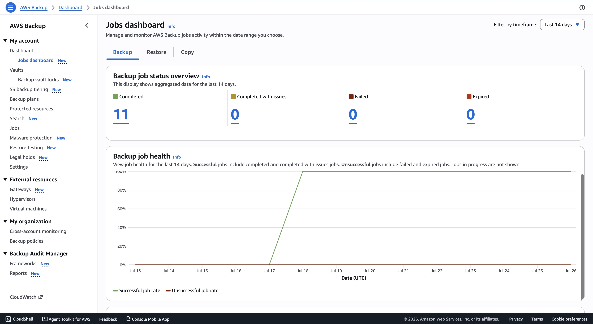
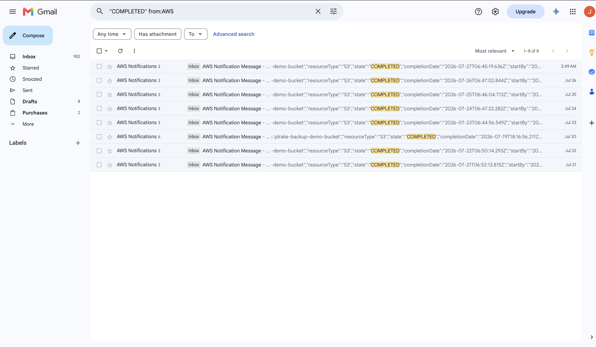
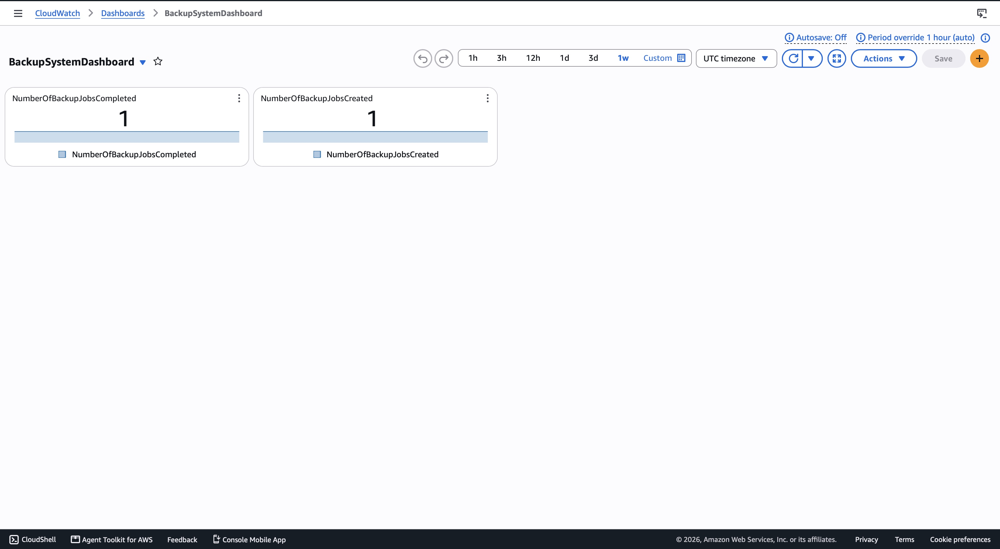
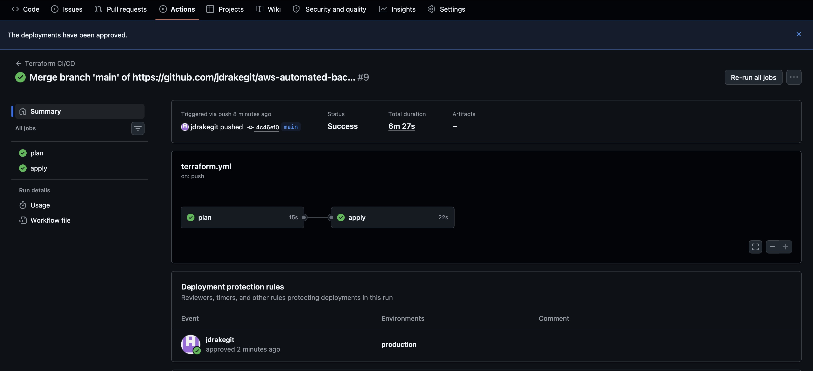

# AWS-Automated-Backup-System
 
An automated AWS backup system I'm building to learn AWS Backup, IAM, and infrastructure as code. Backs up resources on a schedule, alerts me if something fails, and follows least-privilege security practices.

I'm building this project twice. First by clicking through the AWS Console by hand, then again using Terraform, so I can actually learn how infrastructure as code works instead of just reading about it. Since this was my first time using Terraform, I leaned on AI and Google searches to guide me through it, using open resources to actually understand how things worked instead of just copying commands blindly.

---

## Architecture

---

## The Problem

Companies lose data all the time. Someone deletes the wrong file, a server gets corrupted, ransomware hits, or an employee leaves and something important goes missing with them. If backups aren't automatic, they usually don't happen at all, since manual backups depend on someone remembering to do them.

To fix that, backups need to run on their own, without a person clicking anything. That means giving something other than a human the permission to do it, which is where an IAM role comes in. Instead of using my own login, I set up a role that only AWS Backup can use, so it can create backups automatically on a schedule without me needing to be logged in or even awake.

---

# Part 1: Building This by Hand

This was my first real project with AWS Backup. I learned as I went, using AWS documentation and searching the internet to understand each service, work through errors, and figure out why things were built the way they were.

---

## Security Setup

Before creating any resources on AWS, I handled the basic security setup.

- Enabled MFA on my root account
- Enabled MFA on my IAM admin user

Wanted it secured before moving forward.

## IAM Setup

Next, I created the IAM role that AWS Backup actually uses to run backups.

- Created IAM Role: `AWSBackupServiceRole`
- Attached AWS managed policy: `AWSBackupServiceRolePolicyForBackup`

I went with the AWS managed policy instead of writing my own policy, since it already covers exactly what AWS Backup needs. It also means the role can only do things related to backups and nothing else, which follows least privilege. In the future I want to improve my skills writing a fully custom policy myself, just to understand IAM permissions at a deeper level.

## Backup Vault

After that, I created the backup vault where the actual backups are going to be stored.

- Created Backup Vault: `primary-backup-vault`
- Encryption: AWS managed key (`aws/backup`)
- Vault Lock: not enabled

I'm leaving Vault Lock off for now. I want to get the basic backup process working first, then turn it on later. It's mainly for compliance and protecting backups from ransomware.

## Created an S3 Bucket

I created an S3 bucket to actually have something to back up.

- Versioning: enabled
- Public access: fully blocked
- Encryption: SSE-S3  (Amazon S3 managed keys)

I left most of the other settings at their defaults since they were already the recommended options.I turned on versioning since it works well with AWS Backup, keeping older copies of files whenever something changes.

## Backup Plan

Next, I created the actual backup plan that runs the schedule.

- Plan name: `S3BackupPlan`
- Rule: `DailyS3Backup`, runs daily at 12:30 AM
- Retention: 30 days
- Point-in-time recovery: enabled
- IAM role: `AWSBackupServiceRole`
- Resource assigned: my S3 bucket specifically, not all buckets in the account

At first the resource assignment defaulted to an auto-generated IAM role instead of the one I built earlier. I caught it, deleted the assignment,  and redid it using my own role instead.  I also made sure it was only pointing at my one bucket, instead of accidentally including all buckets in the account.

## Testing the Backup

I ran a manual backup just to see if it actually worked, instead of waiting overnight for the schedule.

It failed the first time with a permissions error. The regular AWS Backup policy wasn't enough for S3 by itself.  I had to add one more AWS managed policy, `AWSBackupServiceRolePolicyForS3Backup`, to my IAM role to fix it.

I ran it again after that and it worked. It took a bit since it was the first backup for the bucket, but it finished and created a real recovery point.

## First Automated Backup

The next morning, I checked the Jobs page and saw a new backup that I didn't trigger myself.  It ran automatically overnight at 12:30 AM based on the schedule in my backup plan, and it completed successfully.

This confirmed the automation actually works end to end, not just when I run it manually.

## SNS Notifications

I set up SNS so I could get notified about backups instead of checking the console every time.

- Created a topic called `backup-notifications` (Standard type)
- Subscribed my email to it
- Had to confirm the subscription through an email AWS sent me, which actually went to my spam folder at first

I kept the topic locked down so only I can publish to it or subscribe to it, nobody else.

## EventBridge Rule

The last thing I needed was a way to connect backup job events to my SNS topic, so I could actually get notified instead of checking the console every time.

- Made a rule called `BackupJobStateChange`
- It watches for AWS Backup job status changes
- Sends those events to my SNS topic, `backup-notifications`
- Let AWS create the IAM role for it automatically, since it only needed access to one thing.

Now the whole thing works together. A backup runs, its status changes, EventBridge catches that, and SNS sends me an email.

## Confirmed Notifications Work

I ran another backup to test the SNS setup. It worked, I got three emails, one for each stage       (running, created, completed). The last one showed it finished successfully.

This proved the whole thing works on its own. A backup runs, its status changes, EventBridge catches it, and SNS emails me. No manual checking needed.

One thing I noticed is the emails are just raw JSON, not something easy to read. I want to look into using a small Lambda function later to clean that up.

## CloudWatch Dashboard

I set up a small CloudWatch dashboard to check on backup activity.

- Created a dashboard called `BackupSystemDashboard`
- Added two widgets:  completed jobs and created jobs
- Wanted to track failed jobs too, but that metric doesn't show up until a backup actually fails. I'll add it later if that happens.

---

# Part 2: Rebuilding This in Terraform

Everything above this was built by clicking through the AWS Console. It worked, and I tested it end to end.

Now I'm rebuilding the same thing using Terraform. This was my first real Terraform project, so I used AWS docs, AI, and web searches to figure out the syntax and fix errors as they came up.

---

## Terraform Setup

Installed Terraform with Homebrew. Already had the AWS CLI, so I made a new access key just for this and ran `aws configure` to connect it. First file was just a provider block telling Terraform to use AWS and my region. Ran `terraform init` and it worked.

## Terraform: IAM Role

Wrote `iam.tf` for the role and imported it since it already existed. One policy failed to import because I had the wrong path in the ARN. Checked the real one with the AWS CLI and fixed it. Applied it and it matched.

## Terraform: S3 Bucket

Rebuilt the bucket in code, versioning, public access, and encryption included. One setting called `bucket_key_enabled` was missing from my code. Added it and it matched.

## Terraform: Backup Plan

This one was harder. Wrote the plan and had to import both it and the resource assignment. My schedule was wrong at first, I thought it used UTC but it actually uses my own timezone. Also found out Terraform doesn't support one of the S3 settings yet, so I had to skip it and tell Terraform to ignore that part. Eventually got everything matching.

## Terraform: SNS

Rebuilt the topic and subscription. A couple settings kept showing as different even after I added them to my code. Running apply once fixed it.

## Terraform: EventBridge

Rebuilt the rule and target. The rule was fine, but the target kept failing to import because AWS gives it its own auto generated ID, not the name I typed. Found the real ID with the CLI. Also had to add an IAM role AWS made automatically, or Terraform kept trying to delete it. TextEdit stopped saving my changes at some point, so I started writing files straight from Terminal instead.

## Terraform: CloudWatch Dashboard

Dashboards work differently, the whole thing is one big JSON block instead of separate pieces. Imported it using the dashboard name. Fixed a wrong height and a setting called sparkline that AWS added on its own. Matched after that.

## Terraform: Remote State in S3

Moved Terraform's state into its own S3 bucket instead of keeping it on my laptop. Had to make that bucket with the CLI since Terraform can't create the bucket it stores its own state in. Locked it down the same way as my other bucket and pointed Terraform at it.

## CI/CD Pipeline

Set up GitHub Actions so Terraform runs on its own when I push code. Stored my AWS keys as GitHub Secrets and wrote a workflow to run init, plan, and apply automatically. Had to actually turn this into a real git repo and learn git commands instead of just using the website. Got a permissions error pushing the workflow file, fixed it, pushed again, and it worked.

## CI/CD: Manual Approval Gate

Split the workflow into two parts, plan and apply, so apply waits for my approval. Ran into a merge conflict pushing this and ended up learning git pull, merging, and even got stuck in Vim by accident. Tested it and it worked, plan ran, apply waited, I approved it, and it went through.

## CI/CD: Fixing Unnecessary Runs

Noticed the workflow ran even on small README edits that had nothing to do with the actual infrastructure. Added a filter so it only runs when a Terraform file changes. Tested it, a README edit didn't trigger anything, but a real Terraform change did.

---
