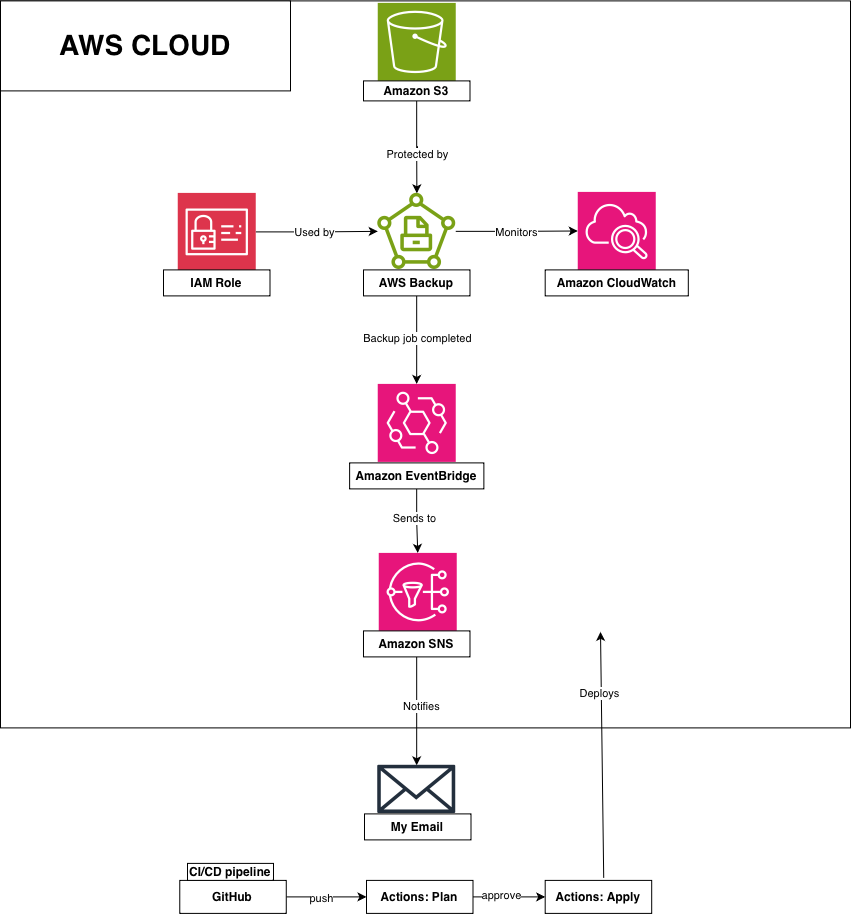

# AWS-Automated-Backup-System
 
An automated AWS backup system I'm building to learn AWS Backup, IAM, and infrastructure as code. Backs up resources on a schedule, alerts me if something fails, and follows least-privilege security practices.

I'm building this project twice. First by clicking through the AWS Console by hand, then again using Terraform, so I can actually learn how infrastructure as code works instead of just reading about it. Since this was my first time using Terraform, I leaned on AI and Google searches to guide me through it, using open resources to actually understand how things worked instead of just copying commands blindly.

---

## Architecture

---

## The Problem

Companies lose data all the time. Someone deletes the wrong file, a server gets corrupted, ransomware hits, or an employee leaves and something important goes missing with them. If backups aren't automatic, they usually don't happen at all, since manual backups depend on someone remembering to do them.

To fix that, backups need to run on their own, without a person clicking anything. That means giving something other than a human the permission to do it, which is where an IAM role comes in. Instead of using my own login, I set up a role that only AWS Backup can use, so it can create backups automatically on a schedule without me needing to be logged in or even awake.

---

# Part 1: Building This by Hand

This was my first real project with AWS Backup. I learned as I went, using AWS documentation and searching the internet to understand each service, work through errors, and figure out why things were built the way they were.

---

## Security Setup

Before creating any resources on AWS, I handled the basic security setup.

- Enabled MFA on my root account
- Enabled MFA on my IAM admin user

Wanted it secured before moving forward.

## IAM Setup

Next, I created the IAM role that AWS Backup actually uses to run backups.

- Created IAM Role: `AWSBackupServiceRole`
- Attached AWS managed policy: `AWSBackupServiceRolePolicyForBackup`

I went with the AWS managed policy instead of writing my own policy, since it already covers exactly what AWS Backup needs. It also means the role can only do things related to backups and nothing else, which follows least privilege. In the future I want to improve my skills writing a fully custom policy myself, just to understand IAM permissions at a deeper level.

## Backup Vault

After that, I created the backup vault where the actual backups are going to be stored.

- Created Backup Vault: `primary-backup-vault`
- Encryption: AWS managed key (`aws/backup`)
- Vault Lock: not enabled

I'm leaving Vault Lock off for now. I want to get the basic backup process working first, then turn it on later. It's mainly for compliance and protecting backups from ransomware.

## Created an S3 Bucket

I created an S3 bucket to actually have something to back up.

- Versioning: enabled
- Public access: fully blocked
- Encryption: SSE-S3  (Amazon S3 managed keys)

I left most of the other settings at their defaults since they were already the recommended options.I turned on versioning since it works well with AWS Backup, keeping older copies of files whenever something changes.

## Backup Plan

Next, I created the actual backup plan that runs the schedule.

- Plan name: `S3BackupPlan`
- Rule: `DailyS3Backup`, runs daily at 12:30 AM
- Retention: 30 days
- Point-in-time recovery: enabled
- IAM role: `AWSBackupServiceRole`
- Resource assigned: my S3 bucket specifically, not all buckets in the account

At first the resource assignment defaulted to an auto-generated IAM role instead of the one I built earlier. I caught it, deleted the assignment,  and redid it using my own role instead.  I also made sure it was only pointing at my one bucket, instead of accidentally including all buckets in the account.

## Testing the Backup

I ran a manual backup just to see if it actually worked, instead of waiting overnight for the schedule.

It failed the first time with a permissions error. The regular AWS Backup policy wasn't enough for S3 by itself.  I had to add one more AWS managed policy, `AWSBackupServiceRolePolicyForS3Backup`, to my IAM role to fix it.

I ran it again after that and it worked. It took a bit since it was the first backup for the bucket, but it finished and created a real recovery point.

## First Automated Backup

The next morning, I checked the Jobs page and saw a new backup that I didn't trigger myself.  It ran automatically overnight at 12:30 AM based on the schedule in my backup plan, and it completed successfully.

This confirmed the automation actually works end to end, not just when I run it manually.

## SNS Notifications

I set up SNS so I could get notified about backups instead of checking the console every time.

- Created a topic called `backup-notifications` (Standard type)
- Subscribed my email to it
- Had to confirm the subscription through an email AWS sent me, which actually went to my spam folder at first

I kept the topic locked down so only I can publish to it or subscribe to it, nobody else.

## EventBridge Rule

The last thing I needed was a way to connect backup job events to my SNS topic, so I could actually get notified instead of checking the console every time.

- Made a rule called `BackupJobStateChange`
- It watches for AWS Backup job status changes
- Sends those events to my SNS topic, `backup-notifications`
- Let AWS create the IAM role for it automatically, since it only needed access to one thing.

Now the whole thing works together. A backup runs, its status changes, EventBridge catches that, and SNS sends me an email.

## Confirmed Notifications Work

I ran another backup to test the SNS setup. It worked, I got three emails, one for each stage       (running, created, completed). The last one showed it finished successfully.

This proved the whole thing works on its own. A backup runs, its status changes, EventBridge catches it, and SNS emails me. No manual checking needed.

One thing I noticed is the emails are just raw JSON, not something easy to read. I want to look into using a small Lambda function later to clean that up.

## CloudWatch Dashboard

I set up a small CloudWatch dashboard to check on backup activity.

- Created a dashboard called `BackupSystemDashboard`
- Added two widgets:  completed jobs and created jobs
- Wanted to track failed jobs too, but that metric doesn't show up until a backup actually fails. I'll add it later if that happens.

---

# Part 2: Rebuilding This in Terraform

Everything above this point was built by clicking through the AWS Console by hand. It all worked, and I tested and confirmed it end to end.

Below this point, I'm rebuilding the same system using Terraform. This was my first real project with it, and I used AI assistance, documentation, and web searches to learn the syntax and debug errors along the way, making sure I understood each piece before moving on.

---

## Terraform Setup

Started setting up Terraform.

- Installed Terraform with Homebrew
- Already had the AWS CLI installed
- Made a new access key for my IAM user just for this
- Ran `aws configure` and confirmed the CLI is using my IAM user

First Terraform file was just a provider block, telling Terraform to use AWS and my region. Ran `terraform init` and it worked.
## Terraform: IAM Role

This was my first time using Terraform, so I started with something I'd already built by hand, the IAM role, to learn how Terraform actually works.

- Wrote `iam.tf` with the role and both policy attachments
- Since the role already existed, I used `terraform import` to bring it under Terraform's management instead of creating a duplicate
- Ran into an error importing the S3 policy attachment. Turned out the actual policy ARN didn't have `/service-role/` in the path like the other one did. Checked it directly with the AWS CLI and found the real ARN, then fixed my code.
- Ran `terraform apply` and it synced everything. The only real change was updating the role's description to match what's in my code now.

This was a good first resource to learn on. Importing existing infrastructure and debugging a real mismatch taught me more than if everything had just worked on the first try.

## Terraform: S3 Bucket

Rebuilt the S3 bucket in Terraform, versioning, public access block, and encryption included.

- Wrote `s3.tf` for all four pieces
- Imported them since they already existed
- Found one mismatch, the bucket had `bucket_key_enabled = true` that wasn't in my code. Added it and it matched.
- Ran `terraform plan` again and got "No changes," meaning my code now matches what's actually in AWS

## Terraform: Backup Plan

This one was harder than the others. First time really seeing how much detail Terraform needs to match reality.

- Wrote `backup.tf` for the plan and the resource assignment
- Had to import both. The assignment needed the plan ID and its own ID combined together
- My first schedule was wrong. I assumed AWS stored the time in UTC, but it actually uses my own timezone. Had to check the real values with the AWS CLI and fix it
- Tried adding the S3 backup options (ACLs and tags) in code, but Terraform doesn't support that for S3 yet, only EC2. Had to leave it out and tell Terraform to ignore that difference instead
- Also had a syntax error from an unclosed block after editing
- Finally got "No changes" after fixing everything, meaning my code actually matches what's really in AWS now

## Terraform: SNS

Rebuilt the SNS topic and subscription in Terraform.

- Wrote `sns.tf` for both
- Topic imported clean
- Subscription needed one extra step, had two settings that kept showing as different even after adding them to my code. Running `terraform apply` once fixed it
- Got "No changes" after that

## Terraform: EventBridge

Rebuilt the EventBridge rule and target in Terraform. Learned a lot here.

- Wrote `eventbridge.tf` for the rule and the SNS target
- The rule imported fine
- The target kept failing though. Turns out AWS gives targets their own auto generated ID, not the name I typed in the console. Had to look up the real ID with the AWS CLI to fix it
- Also learned that AWS quietly created an IAM role for this target when I built it by hand, and I had to add that into my code too or Terraform kept trying to remove it
- TextEdit wasn't actually saving my changes for some reason, so I learned how to write the file directly from Terminal instead
- Finally got "No changes," which meant everything actually matched

## Terraform: CloudWatch Dashboard

Rebuilt the dashboard in Terraform. Last one for this project.

- Wrote `cloudwatch.tf` with both widgets in one big JSON block. Turns out dashboards work differently than everything else, the whole layout is one JSON structure instead of separate resources like the other services
- Imported it using just the dashboard name
- Had two small differences. My guessed height was wrong, and I didn't know AWS had automatically added something called a sparkline to the widgets. Fixed both once I saw them in the plan
- Also added a title that was missing, then applied it
- Ran `terraform plan` one more time and finally got "No changes." Everything in this project is now managed by Terraform

## Terraform: Remote State in S3

Moved Terraform's state into an S3 bucket instead of my laptop.

- Made a new bucket, `jdrake-terraform-state`, using the CLI since Terraform can't create the bucket it stores its own state in
- Locked it down the same way as my other bucket
- Added a `backend "s3"` block to `provider.tf`
- Ran `terraform init -migrate-state` and typed yes
- Ran `terraform plan` again, still said no changes, just reading from S3 now

Needed this so GitHub Actions can use the same state later.

## CI/CD Pipeline

Set up GitHub Actions so Terraform runs on its own instead of me typing commands every time.

- Made a separate S3 bucket just for Terraform's state, since GitHub Actions can't see files on my laptop
- Added my AWS keys as GitHub Secrets so the workflow could log in without putting any keys directly in my code
- Wrote a workflow file that grabs my code, installs Terraform, and runs init, plan, and apply automatically whenever I push to main
- Had to actually turn this into a real git repo. Moved my Terraform files into a `terraform` folder and learned real git commands instead of just using the GitHub website like I had been
- Got a permissions error the first time I pushed the workflow file. Turns out GitHub needs a separate `workflow` permission on my access token, not just `repo`. Fixed that and pushed again
- First real run worked, and Terraform Plan said "No changes," which meant it actually matched my real AWS setup

Right now it applies changes automatically with no approval step in between. I want to add one later so nothing changes without me actually checking it first.

## CI/CD: Manual Approval Gate

Added a step so nothing gets applied to AWS without me checking it first.

- Split the workflow into two jobs, one for plan and one for apply
- Made a GitHub Environment called production and set it to need my approval before running
- Ran into a merge conflict pushing this since I'd edited the README on GitHub and my files locally at the same time. Had to learn git pull and merge, and accidentally got dropped into Vim for the first time
- Tested it by pushing a change. Plan ran on its own, then apply paused and waited for me. I approved it and apply ran right after and worked

Now the pipeline actually pauses and waits for me before changing anything in AWS.

## CI/CD: Fixing Unnecessary Runs

I noticed the workflow was running on every single push, even small README edits I made through GitHub's website. That meant it was running plan and waiting for my approval on changes that had nothing to do with the actual infrastructure.

- Added a `paths` filter so it only runs when something inside the `terraform` folder actually changes
- Cancelled a bunch of old runs that were just stuck waiting because of doc-only commits
- Tested it by editing the README first (nothing triggered) and then editing a Terraform file (it triggered, ran plan, waited for approval, and worked after I approved it)

Now the pipeline only runs when it actually needs to.

## Cleanup

Delete order if I shut this down:

1. GitHub Actions workflow (just delete the `.github/workflows` file, or disable the repo's Actions)
2. EventBridge rule
3. SNS topic
4. CloudWatch dashboard
5. Backup plan
6. Recovery points, then the vault (can't delete a vault with backups inside)
7. S3 bucket
8. IAM role
9. Terraform state bucket (`jdrake-terraform-state`), only after everything else is destroyed through Terraform first

Most of the cost risk is the vault holding backups long-term. Everything else here is free or basically free.

Keeping it running for now since it's part of my portfolio.

## Cost Estimate

This project doesn't cost much at this size.

- S3 storage: only a few cents per month
- AWS Backup: charged based on how much data is backed up and how many backup jobs run
- Amazon SNS and Amazon EventBridge: covered by the AWS Free Tier
- CloudWatch dashboard: small cost after the Free Tier
- Terraform state bucket: a few cents a month at most, it's a small file
- GitHub Actions: free for a public repo

If I backed up more data or kept backups for a longer time, the monthly cost would go up. For me right now, everything falls under the Free Tier, so this project has cost me nothing.
